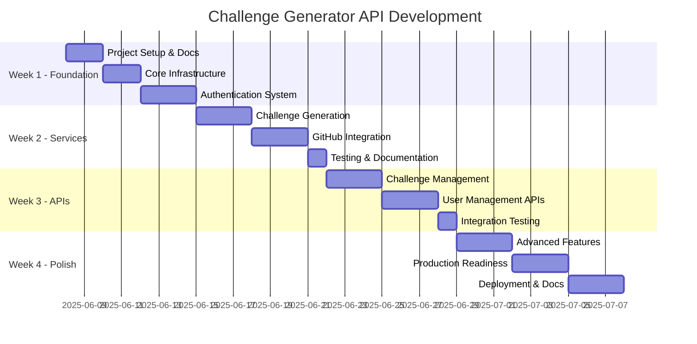

# 🚀 Challenge Generator API - 30-Day Development Timeline

[](https://github.com/your-org/challenge-generator-api)
[](https://github.com/your-org/challenge-generator-docs)
[](https://github.com/your-org/challenge-generator-api)

> **Project Goal**: Build a production-ready FastAPI backend that generates coding challenges and creates GitHub repositories automatically.

## 📊 Overview Dashboard



---

## 🗓️ Week 1: Foundation & Architecture
*Setting up the groundwork for scalable development*

### 📅 Days 1-2: Project Setup & Documentation
-[ ] **Project Structure Creation**
  ```
  challenge_generator/
  ├── app/
  │   ├── __init__.py
  │   ├── main.py
  │   ├── config.py
  │   ├── database.py
  │   ├── models/
  │   ├── schemas/
  │   ├── services/
  │   ├── api/
  │   └── core/
  ├── tests/
  ├── requirements.txt
  ├── .env.example
  └── README.md
  ```
- [ ] **Development Environment Setup**
  - Virtual environment configuration
  - Git workflow setup (pre-commit hooks)
  - IDE configuration (VSCode/PyCharm)
  - Docker environment (optional)
- [ ] **Architecture Documentation**
  - System architecture diagrams
  - Database schema design
  - API specification (OpenAPI)
  - Component interaction flows
- [ ] **GitHub Organization Setup**
  - Repository structure planning
  - Documentation repository creation
  - Issue templates and PR templates

**🎯 End of Day 2 Goal**: Complete project skeleton with comprehensive documentation

---

### 📅 Days 3-4: Core Infrastructure
- [ ] **FastAPI Project Initialization**
  - Basic FastAPI app structure
  - CORS configuration
  - Middleware setup
  - Health check endpoints
- [ ] **Database Setup**
  - PostgreSQL connection configuration
  - SQLAlchemy ORM setup
  - Alembic migrations initialization
  - Database connection testing
- [ ] **Configuration Management**
  - Environment variables handling
  - Settings validation with Pydantic
  - Different environment configs (dev/test/prod)
  - Secrets management strategy
- [ ] **Core Models & Schemas**
  - User model (SQLAlchemy)
  - Challenge model
  - Repository model
  - Pydantic schemas for validation

**🎯 End of Day 4 Goal**: Running FastAPI app with database connectivity

---

### 📅 Days 5-7: Authentication System
- [ ] **JWT Implementation**
  - Token generation and validation
  - Password hashing (bcrypt)
  - Token refresh mechanism
  - Security utilities
- [ ] **GitHub OAuth Integration**
  - GitHub OAuth app setup
  - OAuth flow implementation
  - User profile synchronization
  - Token management
- [ ] **Authentication Endpoints**
  - User registration
  - Login/logout
  - Profile management
  - Password reset (optional)
- [ ] **Security Middleware**
  - Authentication dependency
  - Permission-based access control
  - Rate limiting setup
  - Request validation

**🎯 End of Week 1 Goal**: Fully functional authentication system with GitHub integration

---

## 🗓️ Week 2: Core Services
*Building the heart of the application*

### 📅 Days 8-10: Challenge Generation Service
- [ ] **Claude API Integration**
  - API client setup and configuration
  - Request/response handling
  - Error handling and retries
  - Token usage optimization
- [ ] **Challenge Generation Logic**
  - Prompt engineering for different challenge types
  - Difficulty level algorithms
  - Category-based filtering
  - Tech stack preference handling
- [ ] **Challenge Validation**
  - Content quality checks
  - Duplicate prevention
  - Format validation
  - Metadata extraction
- [ ] **Caching & Optimization**
  - Redis cache implementation (optional)
  - Response caching strategies
  - Performance monitoring
  - Cost optimization

**🎯 End of Day 10 Goal**: Robust challenge generation service with Claude API

---

### 📅 Days 11-13: GitHub Integration Service
- [ ] **GitHub API Wrapper**
  - Repository creation functionality
  - File upload capabilities
  - Repository template management
  - Error handling and validation
- [ ] **Template Management**
  - Dynamic README generation
  - Project structure templates
  - Technology-specific templates
  - Starter code injection
- [ ] **Repository Operations**
  - Repository naming conventions
  - Branch management
  - Issue creation for challenges
  - Repository settings configuration
- [ ] **Integration Testing**
  - Mock GitHub API responses
  - End-to-end repository creation tests
  - Error scenario testing
  - Performance benchmarking

**🎯 End of Day 13 Goal**: Complete GitHub integration with template system

---

### 📅 Day 14: Testing & Documentation
- [ ] **Unit Testing**
  - Service layer tests
  - Model validation tests
  - Utility function tests
  - Edge case coverage
- [ ] **API Documentation**
  - OpenAPI specification update
  - Endpoint documentation
  - Schema documentation
  - Example requests/responses
- [ ] **Code Quality**
  - Code review and refactoring
  - Performance optimization
  - Security vulnerability check
  - Documentation review

**🎯 End of Week 2 Goal**: Well-tested core services with comprehensive documentation

---

## 🗓️ Week 3: API Development
*Creating the public interface*

### 📅 Days 15-17: Challenge Management APIs
- [ ] **Challenge CRUD Operations**
  ```python
  POST /api/v1/challenges/generate
  GET  /api/v1/challenges/
  GET  /api/v1/challenges/{challenge_id}
  PUT  /api/v1/challenges/{challenge_id}
  DELETE /api/v1/challenges/{challenge_id}
  ```
- [ ] **Challenge History & Search**
  - User challenge history
  - Search and filtering capabilities
  - Pagination implementation
  - Sorting options
- [ ] **Advanced Challenge Features**
  - Challenge difficulty adjustment
  - Tag-based categorization
  - Challenge sharing functionality
  - Export capabilities
- [ ] **Validation & Error Handling**
  - Request validation
  - Proper HTTP status codes
  - Error response standardization
  - Input sanitization

**🎯 End of Day 17 Goal**: Complete challenge management API with full CRUD operations

---

### 📅 Days 18-20: User Management APIs
- [ ] **User Profile Management**
  ```python
  GET  /api/v1/users/profile
  PUT  /api/v1/users/profile
  GET  /api/v1/users/preferences
  PUT  /api/v1/users/preferences
  ```
- [ ] **Progress Tracking**
  - Challenge completion tracking
  - Streak calculation
  - Progress statistics
  - Achievement system (optional)
- [ ] **User Settings & Preferences**
  - Difficulty preferences
  - Technology stack preferences
  - Notification settings
  - Privacy controls
- [ ] **Analytics & Reporting**
  - User activity tracking
  - Challenge completion rates
  - Popular challenge types
  - Usage statistics

**🎯 End of Day 20 Goal**: Complete user management system with analytics

---

### 📅 Day 21: Integration Testing
- [ ] **End-to-End API Testing**
  - Complete user journey tests
  - Authentication flow testing
  - Challenge generation to repository creation
  - Error handling validation
- [ ] **Performance Testing**
  - Load testing with realistic scenarios
  - Database query optimization
  - API response time optimization
  - Concurrent user testing
- [ ] **Security Testing**
  - Authentication bypass attempts
  - SQL injection testing
  - Cross-site scripting prevention
  - Rate limiting validation

**🎯 End of Week 3 Goal**: Fully tested and validated API endpoints

---

## 🗓️ Week 4: Polish & Deployment
*Making it production-ready*

### 📅 Days 22-24: Advanced Features
- [ ] **Smart Challenge Recommendations**
  - User behavior analysis
  - Skill gap identification
  - Personalized challenge suggestions
  - Learning path generation
- [ ] **Batch Operations**
  - Bulk challenge generation
  - Batch repository creation
  - Import/export functionality
  - Background job processing
- [ ] **Admin Features**
  - Challenge moderation
  - User management
  - System monitoring
  - Content management
- [ ] **API Versioning**
  - Version strategy implementation
  - Backward compatibility
  - Deprecation handling
  - Migration guides

**🎯 End of Day 24 Goal**: Feature-complete API with advanced capabilities

---

### 📅 Days 25-27: Production Readiness
- [ ] **Error Handling & Logging**
  - Comprehensive error handling
  - Structured logging implementation
  - Error tracking (Sentry integration)
  - Debug mode vs production mode
- [ ] **Security Hardening**
  - Input validation strengthening
  - SQL injection prevention
  - XSS protection
  - HTTPS enforcement
- [ ] **Performance Optimization**
  - Database query optimization
  - Caching implementation
  - Connection pooling
  - Memory usage optimization
- [ ] **Monitoring & Health Checks**
  - Application health endpoints
  - Database health monitoring
  - External service health checks
  - Alerting system setup

**🎯 End of Day 27 Goal**: Production-ready, secure, and monitored API

---

### 📅 Days 28-30: Deployment & Documentation
- [ ] **Containerization**
  - Docker image creation
  - Multi-stage builds
  - Environment-specific configurations
  - Container security best practices
- [ ] **Production Deployment**
  - Cloud deployment setup (AWS/GCP/Azure)
  - Database migration scripts
  - Environment variable management
  - SSL certificate setup
- [ ] **Complete Documentation**
  - API documentation finalization
  - Deployment guides
  - Troubleshooting guides
  - Contributing guidelines
- [ ] **Release Preparation**
  - Version tagging
  - Release notes
  - Change log
  - Migration guides

**🎯 End of Day 30 Goal**: Deployed, documented, and production-ready API

---

## 📈 Success Metrics & Checkpoints

### Weekly Checkpoints
- **Week 1**: ✅ Foundation complete - Can run authenticated FastAPI app
- **Week 2**: ✅ Core services working - Can generate challenges and create repos
- **Week 3**: ✅ API functional - All endpoints working and tested
- **Week 4**: ✅ Production ready - Deployed and documented

### Key Performance Indicators
- [ ] **API Response Time**: < 500ms for challenge generation
- [ ] **Test Coverage**: > 90% code coverage
- [ ] **Documentation**: 100% API endpoints documented
- [ ] **Security**: Zero critical security vulnerabilities
- [ ] **Performance**: Handle 100 concurrent users

---

## 🛠️ Tools & Technologies

### Development Stack
- **Framework**: FastAPI 0.104+
- **Database**: PostgreSQL 15+
- **ORM**: SQLAlchemy 2.0+
- **Authentication**: JWT + GitHub OAuth
- **Testing**: pytest + httpx
- **Documentation**: OpenAPI/Swagger

### External Services
- **AI**: Claude API (Anthropic)
- **Version Control**: GitHub API
- **Caching**: Redis (optional)
- **Monitoring**: Sentry (optional)

### Development Tools
- **Environment**: Python 3.11+
- **Package Manager**: pip + requirements.txt
- **Code Quality**: black, flake8, mypy
- **Containerization**: Docker
- **CI/CD**: GitHub Actions

---

## 🎯 Daily Commitment

| Days | Time Investment | Focus Areas |
|------|----------------|-------------|
| **Weekdays** | 3-4 hours | Core development, documentation |
| **Weekends** | 4-5 hours | Integration, testing, review |
| **Total/Week** | 25-30 hours | Consistent progress tracking |

---

## 📚 Learning Outcomes

By the end of 30 days, you'll have mastered:
- ✅ **FastAPI**: Advanced API development patterns
- ✅ **Database Design**: PostgreSQL + SQLAlchemy best practices
- ✅ **Authentication**: JWT + OAuth implementation
- ✅ **External APIs**: Claude API + GitHub API integration
- ✅ **Testing**: Comprehensive testing strategies
- ✅ **Deployment**: Production deployment and monitoring
- ✅ **Documentation**: Professional API documentation

*Last Updated: June 8, 2025*  
*Next Review: June 15, 2025*